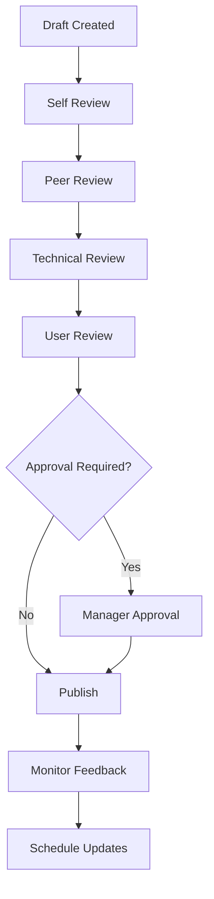

# Agent-Agnostic SSOT Implementation Guide

**Version**: 1.0.0  
**Date**: 2025-01-24  
**Target Audience**: Development Teams, Technical Writers, Project Managers

---

## Overview

This implementation guide provides step-by-step instructions for adopting the Agent-Agnostic SSOT Documentation Framework in your projects. It covers setup, configuration, content generation, validation, and maintenance processes that work with any AI agent.

### Implementation Philosophy

- **Incremental Adoption**: Start small, expand gradually
- **Tool Agnostic**: Works with any AI platform
- **Quality First**: Built-in validation at every step
- **Automation Ready**: Designed for continuous integration
- **Team Scalable**: Adapts from solo developers to large teams

---

## Phase 1: Foundation Setup

### 1.1 Environment Preparation

#### System Requirements
- **Operating System**: Any (Windows, macOS, Linux)
- **Version Control**: Git (required)
- **Text Editor**: Any with Markdown support
- **Python**: 3.8+ (for validation scripts, optional)
- **AI Access**: Any AI agent (ChatGPT, Claude, Gemini, etc.)

#### Directory Structure Creation
```bash
# Navigate to your project directory
cd /path/to/your/project

# Create the SSOT directory structure
mkdir -p docs/{tutorials,how-to-guides,reference,explanation}
mkdir -p specs/{architecture,features,research,standards}
mkdir -p evidence/{visual-baselines,performance,testing}
mkdir -p templates/{ssot-templates,diataxis-templates}
mkdir -p scripts

# Create initial placeholder files
touch specs/purpose.md
touch specs/functional_spec.md
touch specs/technical_spec.md
touch specs/architecture/README.md
touch README.md
touch .gitignore

# Set up Git if not already done
git init
git add .
git commit -m "Initial SSOT framework structure"
```

#### Git Configuration
Create `.gitignore`:
```gitignore
# Python cache
__pycache__/
*.pyc
*.pyo

# AI agent cache
.ai-agent-cache/
.claude-session/

# Temporary files
*.tmp
*.temp
.DS_Store

# Generated artifacts (optional)
# generated/
```

### 1.2 Template Installation

#### Download Core Templates
Create the essential template files:

**`templates/ssot-templates/purpose-template.md`**:
```markdown
# Project Purpose: [Project Name]

## Problem Statement
[Current system/process] currently averages [X time/cost/effort] for [key process], causing [Y% impact] of [stakeholders] to [negative outcome] and contributing to [Z% business impact] in [relevant metric].

## Target Users
- Primary: [N] [frequency] active [user type] [performing action]
- Secondary: [N] [role] handling [N+] [activities]/[time period]
- Tertiary: [stakeholder group] tracking [relevant metrics]

## Scope
**Included (minimum 5 items):**
- [Specific feature] for [N] most [common cases]
- [Process automation] based on [classification criteria]
- [Data access] for [specific information types]
- Integration with [External System] API for [specific purpose]
- [Measurement capability] and [SLA tracking]

**Excluded (minimum 5 items):**
- [Complex scenario] requiring [system access/expertise]
- [High-value transactions] exceeding $[threshold]
- [System modifications] ([specific examples])
- [Additional scope] beyond [primary language/channel]
- [Integration type] with [other systems]

## Success Criteria (minimum 3 measurable metrics)
- Reduce [process time] from [baseline] to <[target] for [percentage]% of [transactions]
- Achieve [percentage]% [automation rate] for [process type] (currently [baseline]%)
- Maintain [satisfaction metric] ≥[target]/[scale] (baseline: [current score])

## Key Assumptions (minimum 3 with validation criteria)
- [Stakeholders] accept [new process] (validated through [sample size]-[method])
- [External System] API supports [load increase]% increased call volume ([validation method])
- [Users] adopt new workflow within [timeframe] ([enablement plan] required)

## Context & Constraints
**Business:** [Initiative name], success measured by [primary KPI]
**Budget:** $[total] total ($[breakdown] development, $[amount] infrastructure)
**Timeline:** [duration] ([milestone] in [timeframe], full deployment [schedule])
**Team:** [team composition] with [AI assistance level]
**Technical:** Must integrate with existing [System], maintain [uptime]% uptime

*Word count: [actual count] words*
```

**`templates/ssot-templates/adr-template.md`**:
```markdown
# ADR-XXX: [Decision Title]

**Status**: [Accepted/Rejected/Deprecated]
**Date**: YYYY-MM-DD
**Deciders**: [Roles/Teams]
**Evidence Source**: [References]

## Context
[Problem statement with evidence]

## Decision
[What was decided and why]

## Consequences
**Positive**: [Benefits]
**Negative**: [Trade-offs]
**Neutral**: [Other implications]

## Alternatives Considered
[Other options and rejection rationale]

## Related Decisions
- [Links to related ADRs]
```

#### Diátaxis Framework Templates
Create user documentation templates:

**`templates/diataxis-templates/tutorial-template.md`**:
```markdown
# [Tutorial Title]: [Learning Objective]

**Prerequisites**: [What users need before starting]
**Time Required**: [Estimated completion time]
**Target Audience**: [Who this tutorial is for]

## Learning Objectives
After completing this tutorial, you will be able to:
- [Specific skill 1]
- [Specific skill 2]
- [Specific skill 3]

## Step-by-Step Guide

### Step 1: [Action Title]
[Detailed instructions with expected outcomes]

**Verification**: [How to confirm step is complete]

### Step 2: [Action Title]
[Continue with numbered steps...]

## Practice Exercise
[Hands-on activity to reinforce learning]

## Summary
[Recap of what was learned]

## Next Steps
[Where to go after this tutorial]
```

### 1.3 Validation Scripts Setup

#### Python Validation Script
Create `scripts/validate_ssot.py`:
```python
#!/usr/bin/env python3
"""
SSOT Documentation Validation Script
Works with any project using the Agent-Agnostic SSOT Framework
"""

import os
import re
import yaml
import json
from pathlib import Path
from typing import Dict, List, Tuple

class SSOTValidator:
    def __init__(self, project_root: str = "."):
        self.project_root = Path(project_root)
        self.issues = []
        self.warnings = []
        
    def validate_all(self) -> Dict:
        """Run complete validation suite"""
        results = {
            "structure": self.validate_structure(),
            "content": self.validate_content(),
            "cross_references": self.validate_cross_references(),
            "quality": self.validate_quality(),
            "overall_score": 0
        }
        
        # Calculate overall score
        scores = [
            results["structure"]["score"],
            results["content"]["score"],
            results["cross_references"]["score"],
            results["quality"]["score"]
        ]
        results["overall_score"] = sum(scores) / len(scores)
        
        return results
    
    def validate_structure(self) -> Dict:
        """Validate directory and file structure"""
        required_dirs = [
            "docs/tutorials",
            "docs/how-to-guides", 
            "docs/reference",
            "docs/explanation",
            "specs/architecture",
            "specs/features",
            "specs/research",
            "specs/standards",
            "evidence/visual-baselines",
            "evidence/performance",
            "evidence/testing",
            "templates/ssot-templates",
            "templates/diataxis-templates",
            "scripts"
        ]
        
        required_files = [
            "specs/purpose.md",
            "specs/functional_spec.md", 
            "specs/technical_spec.md",
            "README.md"
        ]
        
        missing_dirs = []
        missing_files = []
        
        for dir_path in required_dirs:
            if not (self.project_root / dir_path).exists():
                missing_dirs.append(dir_path)
                
        for file_path in required_files:
            if not (self.project_root / file_path).exists():
                missing_files.append(file_path)
        
        score = 100 - (len(missing_dirs) * 5) - (len(missing_files) * 10)
        score = max(0, score)
        
        return {
            "score": score,
            "missing_directories": missing_dirs,
            "missing_files": missing_files,
            "issues": self.issues
        }
    
    def validate_content(self) -> Dict:
        """Validate content quality and completeness"""
        content_issues = []
        
        # Validate purpose document
        purpose_path = self.project_root / "specs/purpose.md"
        if purpose_path.exists():
            purpose_issues = self._validate_purpose_document(purpose_path)
            content_issues.extend(purpose_issues)
        
        # Validate functional spec
        func_spec_path = self.project_root / "specs/functional_spec.md"
        if func_spec_path.exists():
            func_issues = self._validate_functional_spec(func_spec_path)
            content_issues.extend(func_issues)
        
        # Validate technical spec
        tech_spec_path = self.project_root / "specs/technical_spec.md"
        if tech_spec_path.exists():
            tech_issues = self._validate_technical_spec(tech_spec_path)
            content_issues.extend(tech_issues)
        
        score = max(0, 100 - len(content_issues) * 5)
        
        return {
            "score": score,
            "content_issues": content_issues,
            "total_issues": len(content_issues)
        }
    
    def _validate_purpose_document(self, file_path: Path) -> List[str]:
        """Validate purpose document specific requirements"""
        issues = []
        content = file_path.read_text()
        
        # Word count check
        word_count = len(content.split())
        if word_count > 500:
            issues.append(f"Purpose document exceeds 500 words ({word_count} words)")
        
        # Check for required sections
        required_sections = [
            "Problem Statement",
            "Target Users", 
            "Scope",
            "Success Criteria",
            "Key Assumptions",
            "Context & Constraints"
        ]
        
        for section in required_sections:
            if section not in content:
                issues.append(f"Missing required section: {section}")
        
        # Check for measurable metrics
        success_criteria_section = re.search(r"## Success Criteria.*?(?=##|\Z)", content, re.DOTALL)
        if success_criteria_section:
            criteria_text = success_criteria_section.group()
            # Look for patterns like "reduce X to Y", "achieve Z%", "maintain ≥W"
            measurable_patterns = [
                r"reduce.*to\s*<\d+",
                r"achieve\s*\d+%",
                r"maintain\s*≥\d+",
                r"from\s*\d+\s*to\s*<\d+"
            ]
            
            measurable_count = sum(1 for pattern in measurable_patterns 
                                 if re.search(pattern, criteria_text, re.IGNORECASE))
            
            if measurable_count < 3:
                issues.append(f"Only {measurable_count} measurable success criteria found (minimum 3 required)")
        
        return issues
    
    def _validate_functional_spec(self, file_path: Path) -> List[str]:
        """Validate functional specification requirements"""
        issues = []
        content = file_path.read_text()
        
        # Check for user journeys
        if "User Journey" not in content and "User Journeys" not in content:
            issues.append("Missing User Journeys section")
        
        # Check for acceptance criteria
        if "Acceptance Criteria" not in content:
            issues.append("Missing Acceptance Criteria section")
        
        return issues
    
    def _validate_technical_spec(self, file_path: Path) -> List[str]:
        """Validate technical specification requirements"""
        issues = []
        content = file_path.read_text()
        
        # Check for architecture diagram
        if "```mermaid" not in content:
            issues.append("Missing architecture diagram (should use Mermaid)")
        
        # Check for performance requirements
        if "Performance" not in content:
            issues.append("Missing Performance Requirements section")
        
        return issues
    
    def validate_cross_references(self) -> Dict:
        """Validate internal links and references"""
        # Implementation for cross-reference validation
        return {"score": 100, "broken_links": [], "issues": []}
    
    def validate_quality(self) -> Dict:
        """Validate overall quality metrics"""
        # Implementation for quality validation
        return {"score": 100, "quality_metrics": {}, "issues": []}

def main():
    import argparse
    
    parser = argparse.ArgumentParser(description="Validate SSOT Documentation")
    parser.add_argument("--project-root", default=".", help="Project root directory")
    parser.add_argument("--output", choices=["text", "json"], default="text", help="Output format")
    parser.add_argument("--verbose", "-v", action="store_true", help="Verbose output")
    
    args = parser.parse_args()
    
    validator = SSOTValidator(args.project_root)
    results = validator.validate_all()
    
    if args.output == "json":
        print(json.dumps(results, indent=2))
    else:
        print(f"SSOT Validation Results")
        print(f"Overall Score: {results['overall_score']}/100")
        print(f"Structure: {results['structure']['score']}/100")
        print(f"Content: {results['content']['score']}/100")
        print(f"Cross-References: {results['cross_references']['score']}/100")
        print(f"Quality: {results['quality']['score']}/100")
        
        if results['overall_score'] < 80:
            print("\n⚠️  Issues found that need attention:")
            for category in ['structure', 'content']:
                if results[category].get('issues'):
                    for issue in results[category]['issues']:
                        print(f"  - {issue}")

if __name__ == "__main__":
    main()
```

Make the script executable:
```bash
chmod +x scripts/validate_ssot.py
```

---

## Phase 2: Content Generation

### 2.1 AI Agent Preparation

#### Choose Your AI Agent
Select based on your needs:

**ChatGPT (GPT-4)**
- Strengths: Creative writing, complex reasoning
- Best for: Initial drafts, explanations, tutorials
- Limitations: May need more specific formatting guidance

**Claude (Claude-3)**
- Strengths: Technical accuracy, structured output
- Best for: Technical specifications, API documentation
- Limitations: Less creative, more literal

**Gemini (Google)**
- Strengths: Multi-modal, research integration
- Best for: Research-backed documentation, visual content
- Limitations: Newer platform, less established patterns

**Custom Agents**
- Strengths: Tailored to your specific needs
- Best for: Specialized domains, proprietary formats
- Limitations: Requires development and maintenance

#### System Prompt Setup
Configure your AI agent with this system prompt:

```
You are an expert technical documentation specialist implementing the Agent-Agnostic SSOT Documentation Framework. 

Your core responsibilities:
1. Follow the SSOT methodology for all technical specifications
2. Apply the Diátaxis framework for user documentation
3. Ensure all content includes measurable metrics and specific criteria
4. Use the provided templates exactly as specified
5. Validate all cross-references and internal links
6. Generate content that is clear, specific, and actionable

Quality Standards:
- All success criteria must be quantifiable with specific targets
- Technical terms must be defined or avoided
- Include specific examples and verification steps
- Use consistent terminology throughout
- Provide actionable next steps

Always structure your output according to the requested format and validate against all constraints before providing the final result.
```

### 2.2 Core Specification Generation

#### Step 1: Generate Purpose Specification
Use the Purpose Generation Prompt:

```
CONTEXT: I'm starting a new project called [PROJECT_NAME]. The initial idea is [BRIEF_DESCRIPTION]. The target users are [USER_DESCRIPTION]. The main problem we're solving is [PROBLEM_DESCRIPTION].
TASK: Generate a complete purpose specification following the SSOT framework.
FORMAT: Use the exact template in templates/ssot-templates/purpose-template.md
CONSTRAINTS:
- Maximum 500 words total
- Minimum 3 quantifiable success metrics with numeric targets
- At least 5 scope inclusions and 5 exclusions
- All technical terms must be defined or avoided
- Include specific user counts and metrics
- Problem statement must be quantified with current impact
```

**Implementation Steps:**
1. Replace bracketed placeholders with your project details
2. Submit to your chosen AI agent
3. Review the output against the template
4. Save as `specs/purpose.md`
5. Run validation: `python scripts/validate_ssot.py`

#### Step 2: Generate Functional Specification
Use the Functional Spec Prompt:

```
CONTEXT: Based on the approved purpose in specs/purpose.md for [PROJECT_NAME], we need to define functional requirements. The purpose states [PURPOSE_SUMMARY]. Key user needs identified are [USER_NEEDS].
TASK: Generate a complete functional specification.
FORMAT: Markdown with sections: Feature Overview, User Journeys (minimum 3), Acceptance Criteria (testable with thresholds), Data Requirements, Integration Points.
CONSTRAINTS:
- Each user journey must include measurable success metrics
- Acceptance criteria must be testable and specific with numeric thresholds
- Include data flow diagrams using Mermaid syntax
- Reference the purpose specification directly
- Minimum 3 user journeys covering different personas
- Each acceptance criterion must be verifiable
```

**Implementation Steps:**
1. Read your `specs/purpose.md` file
2. Extract key information for the context
3. Submit the prompt to your AI agent
4. Validate the output includes all required sections
5. Save as `specs/functional_spec.md`
6. Update cross-references

#### Step 3: Generate Technical Specification
Use the Technical Spec Prompt:

```
CONTEXT: Based on the functional specification in specs/functional_spec.md for [PROJECT_NAME], we need technical implementation details. The functional requirements include [FUNCTIONAL_SUMMARY].
TASK: Generate a comprehensive technical specification.
FORMAT: Markdown with sections: Architecture Overview (with Mermaid diagrams), Technology Stack (with versions), Component Design, Performance Requirements (with target/max thresholds), Security Considerations, Deployment Architecture.
CONSTRAINTS:
- Include system architecture diagram using Mermaid
- Specify exact versions for all technologies
- Include performance benchmarks with measurable targets and maximums
- Address security requirements with specific standards
- Define scaling strategy and capacity planning
- Include monitoring and observability requirements
- Specify data storage and backup strategies
```

**Implementation Steps:**
1. Review your `specs/functional_spec.md`
2. Identify technical requirements and constraints
3. Submit to AI agent with specific technology preferences
4. Verify all technical details are included
5. Save as `specs/technical_spec.md`
6. Validate Mermaid diagram syntax

### 2.3 Architecture Decision Records

#### Creating ADRs
For each significant technical decision:

```
CONTEXT: We need to decide on [TECHNICAL_DECISION] for our project [PROJECT_NAME]. Current situation: [CURRENT_STATE]. Options being considered: [OPTION_A], [OPTION_B], [OPTION_C]. We have constraints: [CONSTRAINTS].
TASK: Create an Architecture Decision Record (ADR) following the SSOT template.
FORMAT: Use the exact template in templates/ssot-templates/adr-template.md
CONSTRAINTS:
- Include specific evidence for the decision
- List at least 2 alternatives with detailed rejection rationale
- Document measurable consequences where possible
- Reference relevant standards or best practices
- Include implementation considerations
- Consider long-term maintenance impact
```

**ADR Management Process:**
1. Number ADRs sequentially (ADR-001, ADR-002, etc.)
2. Store in `specs/architecture/`
3. Update `specs/architecture/README.md` index
4. Reference ADRs in technical specifications
5. Review and update status as needed

---

## Phase 3: User Documentation (Diátaxis Framework)

### 3.1 Tutorial Generation

#### Getting Started Tutorial
```
CONTEXT: We have implemented [FEATURE_NAME] in [PROJECT_NAME]. The target users are [BEGINNER_USERS] with no prior experience. The main user journey is [USER_JOURNEY_SUMMARY].
TASK: Generate a step-by-step tutorial for beginners.
FORMAT: Use the template in templates/diataxis-templates/tutorial-template.md
CONSTRAINTS:
- Each step must be actionable and verifiable
- Include screenshots or visual descriptions where helpful
- Provide expected outcomes for each step
- Include troubleshooting tips for common issues
- Estimated completion time: 30-45 minutes
- No prior knowledge assumed
- Include hands-on exercises for reinforcement
```

#### Tutorial Implementation
1. Save as `docs/tutorials/getting-started.md`
2. Include practical exercises
3. Add screenshots or diagrams
4. Test each step yourself
5. Get feedback from actual beginners

### 3.2 How-To Guide Generation

#### Problem-Solution Guides
```
CONTEXT: Users frequently encounter the problem [PROBLEM_DESCRIPTION] when using [FEATURE_NAME]. Current solutions are [CURRENT_SOLUTIONS]. We need a clear step-by-step solution.
TASK: Generate a how-to guide solving this specific problem.
FORMAT: How-To Guide with sections: Problem Description, Prerequisites, Solution Steps, Verification, Common Issues, Related Solutions.
CONSTRAINTS:
- Focus on one specific problem and solution
- Steps must be ordered and actionable
- Include verification steps to confirm success
- Address common pitfalls and mistakes
- Provide alternative approaches if applicable
- Estimated completion time: 10-15 minutes
- Include "What you'll need" checklist
```

#### How-To Implementation
1. Create focused, problem-specific guides
2. Use clear, action-oriented titles
3. Include verification steps
4. Add troubleshooting sections
5. Link to related guides

### 3.3 Reference Material Generation

#### API Reference Documentation
```
CONTEXT: We have an API for [API_PURPOSE] with endpoints [ENDPOINT_LIST]. The technical specification is in [TECH_SPEC_FILE]. We need comprehensive reference documentation.
TASK: Generate complete API reference documentation.
FORMAT: Reference documentation with sections: Authentication, Base URL, Endpoints (with request/response examples), Error Codes, Rate Limits, SDK Examples.
CONSTRAINTS:
- Include every endpoint with full details
- Provide request/response examples in JSON
- Document all error codes with solutions
- Include authentication examples
- Provide code samples in multiple languages
- Use consistent formatting throughout
- Include pagination and filtering documentation
```

#### Reference Implementation
1. Generate from technical specifications
2. Include comprehensive examples
3. Use consistent formatting
4. Add code samples in multiple languages
5. Include troubleshooting sections

### 3.4 Explanation Documentation

#### Concept Explanations
```
CONTEXT: Users need to understand [CONCEPT_NAME] to effectively use [FEATURE_NAME]. Common misconceptions include [MISCONCEPTIONS]. The underlying principles are [PRINCIPLES].
TASK: Generate an in-depth explanation of the concept.
FORMAT: Explanation with sections: What is [Concept], Why It Matters, How It Works, Common Misconceptions, Real-World Analogies, Related Concepts.
CONSTRAINTS:
- Use clear, non-technical language where possible
- Include analogies and real-world examples
- Address common misconceptions directly
- Provide historical context if relevant
- Include visual descriptions or diagrams
- Connect to practical usage
- Target audience: intelligent non-experts
```

---

## Phase 4: Validation and Quality Assurance

### 4.1 Automated Validation

#### Running Validation Scripts
```bash
# Run complete validation suite
python scripts/validate_ssot.py

# Run with verbose output
python scripts/validate_ssot.py --verbose

# Output results as JSON for CI/CD
python scripts/validate_ssot.py --output json > validation-results.json
```

#### Continuous Integration Setup
Create `.github/workflows/docs-validation.yml`:
```yaml
name: Documentation Validation

on:
  push:
    branches: [ main, develop ]
  pull_request:
    branches: [ main ]

jobs:
  validate-docs:
    runs-on: ubuntu-latest
    
    steps:
    - uses: actions/checkout@v3
    
    - name: Set up Python
      uses: actions/setup-python@v4
      with:
        python-version: '3.9'
    
    - name: Install dependencies
      run: |
        python -m pip install --upgrade pip
        pip install pyyaml
    
    - name: Validate SSOT Documentation
      run: |
        python scripts/validate_ssot.py --output json > results.json
        
    - name: Check Validation Score
      run: |
        SCORE=$(python -c "import json; print(json.load(open('results.json'))['overall_score'])")
        if [ $SCORE -lt 80 ]; then
          echo "Validation score $SCORE is below threshold 80"
          exit 1
        fi
        echo "Validation passed with score $SCORE"
        
    - name: Upload Results
      uses: actions/upload-artifact@v3
      with:
        name: validation-results
        path: results.json
```

### 4.2 Manual Quality Review

#### Quality Checklist
Create `docs/quality-checklist.md`:
```markdown
# Documentation Quality Checklist

## Content Quality
- [ ] All success criteria are measurable with specific targets
- [ ] Technical terms are defined or avoided
- [ ] Examples are practical and verifiable
- [ ] Cross-references are accurate and complete

## Structure Compliance
- [ ] All required files exist
- [ ] Directory structure follows SSOT framework
- [ ] File naming conventions are consistent
- [ ] Templates are used correctly

## Diátaxis Framework
- [ ] Tutorials include learning objectives and exercises
- [ ] How-to guides solve specific problems
- [ ] Reference material is comprehensive and accurate
- [ ] Explanations provide deep understanding

## Technical Accuracy
- [ ] Code examples are tested and functional
- [ ] API specifications match implementation
- [ ] Performance benchmarks are realistic
- [ ] Security considerations are addressed

## User Experience
- [ ] Document flow is logical and progressive
- [ ] Navigation is clear and intuitive
- [ ] Search terms and keywords are included
- [ ] Feedback mechanisms are available
```

#### Review Process
1. **Self-Review**: Author completes checklist
2. **Peer Review**: Team member validates content
3. **Technical Review**: Expert validates technical accuracy
4. **User Review**: Actual user tests the documentation
5. **Final Approval**: Project manager signs off

---

## Phase 5: Maintenance and Evolution

### 5.1 Documentation Maintenance Process

#### Regular Maintenance Schedule
```yaml
Weekly Tasks:
  - Review and update recent changes
  - Check for broken links
  - Update performance metrics
  - Review user feedback

Monthly Tasks:
  - Comprehensive quality review
  - Update tutorials and examples
  - Review and update ADRs
  - Check compliance with standards

Quarterly Tasks:
  - Major documentation audit
  - Template updates and improvements
  - User experience research
  - Integration testing updates

Annual Tasks:
  - Framework evaluation and updates
  - Tool and process assessment
  - Team training and knowledge sharing
  - Industry best practices review
```

#### Change Management Process
```python
# scripts/update_documentation.py
import os
import subprocess
from datetime import datetime

def update_documentation(change_description):
    """Update documentation for project changes"""
    
    # 1. Identify affected documentation
    affected_files = identify_affected_docs(change_description)
    
    # 2. Generate update prompts
    for file_path in affected_files:
        prompt = generate_update_prompt(file_path, change_description)
        
        # 3. Apply updates (manual AI interaction)
        print(f"Update needed for {file_path}")
        print(f"Prompt: {prompt}")
        
    # 4. Validate updates
    subprocess.run(["python", "scripts/validate_ssot.py"])
    
    # 5. Commit changes
    commit_message = f"docs: Update for {change_description}"
    subprocess.run(["git", "add", "docs/", "specs/"])
    subprocess.run(["git", "commit", "-m", commit_message])

def identify_affected_docs(change_description):
    """Identify which documentation files need updates"""
    # Logic to map changes to documentation files
    return []
```

### 5.2 Continuous Improvement

#### Metrics Collection
Track these metrics to improve documentation quality:

```python
# Documentation Quality Metrics
metrics = {
    "completeness_score": 0,  # From validation script
    "user_satisfaction": 0,   # From user surveys
    "support_ticket_reduction": 0,  # From support system
    "time_to_first_success": 0,  # User onboarding metrics
    "documentation_usage": 0,  # Analytics data
    "contribution_rate": 0,   # Team participation
    "update_frequency": 0,    # How often docs are updated
    "accuracy_score": 0       # User feedback on accuracy
}
```

#### Feedback Integration
Create `docs/feedback.md`:
```markdown
# Documentation Feedback

## How to Provide Feedback
- GitHub Issues: Tag with `documentation`
- Email: docs-team@company.com
- In-App Feedback: Use the feedback widget
- Surveys: Quarterly documentation surveys

## Feedback Categories
- [ ] Accuracy Issues
- [ ] Missing Information
- [ ] Confusing Content
- [ ] Outdated Examples
- [ ] Broken Links
- [ ] Format Problems
- [ ] Accessibility Issues

## Recent Feedback
<!-- Maintain table of recent feedback and actions taken -->
| Date | Issue | Category | Status | Action |
|------|-------|----------|--------|--------|
```

---

## Phase 6: Team Adoption and Training

### 6.1 Team Onboarding

#### Training Curriculum
```markdown
# SSOT Framework Training Program

## Module 1: Framework Overview (2 hours)
- SSOT methodology principles
- Diátaxis framework introduction
- Agent-agnostic approach benefits
- Hands-on directory structure setup

## Module 2: Content Generation (4 hours)
- AI agent selection and configuration
- Prompt engineering best practices
- Template usage and customization
- Quality validation techniques

## Module 3: Advanced Features (3 hours)
- Automation and CI/CD integration
- Cross-reference management
- Performance documentation
- Security documentation standards

## Module 4: Maintenance and Governance (2 hours)
- Documentation lifecycle management
- Quality metrics and KPIs
- Team collaboration workflows
- Continuous improvement processes
```

#### Role-Specific Guidelines

**For Developers:**
- Focus on technical specifications and API documentation
- Maintain accuracy of code examples
- Update documentation with feature changes
- Participate in technical reviews

**For Technical Writers:**
- Ensure consistency across all documentation
- Apply Diátaxis framework correctly
- Manage user documentation and tutorials
- Lead quality improvement initiatives

**For Project Managers:**
- Ensure documentation milestones are met
- Coordinate documentation reviews
- Track quality metrics and KPIs
- Allocate resources for maintenance

**For QA Engineers:**
- Validate documentation accuracy
- Test tutorials and how-to guides
- Verify cross-references and links
- Report documentation bugs

### 6.2 Governance Model

#### Documentation Ownership
```yaml
Ownership Matrix:
  specs/purpose.md: Project Manager
  specs/functional_spec.md: Product Owner
  specs/technical_spec.md: Tech Lead
  specs/architecture/: Architecture Team
  docs/tutorials/: Technical Writer
  docs/how-to-guides: Development Team
  docs/reference/: Subject Matter Experts
  docs/explanation/: Architecture Team
```

#### Review and Approval Process


---

## Troubleshooting Guide

### Common Implementation Issues

#### Issue: AI Agent Not Following Templates
**Symptoms**: Generated content doesn't match expected format
**Causes**: Insufficient context, unclear constraints
**Solutions**:
1. Include template content directly in prompt
2. Use "FORMAT MUST BE:" emphasis
3. Break complex requests into smaller prompts
4. Provide examples of good vs bad output

#### Issue: Validation Scripts Fail
**Symptoms**: Python errors, missing dependencies
**Causes**: Python version issues, missing packages
**Solutions**:
1. Ensure Python 3.8+ is installed
2. Install required packages: `pip install pyyaml`
3. Check file permissions
4. Verify directory structure

#### Issue: Low Quality Scores
**Symptoms**: Validation score below 80%
**Causes**: Missing content, vague requirements
**Solutions**:
1. Review validation report for specific issues
2. Add measurable metrics to success criteria
3. Include all required sections
4. Verify cross-references are accurate

#### Issue: Team Adoption Resistance
**Symptoms**: Team not using new framework
**Causes**: Lack of training, perceived overhead
**Solutions**:
1. Provide comprehensive training
2. Start with pilot project
3. Demonstrate time savings
4. Gather and address feedback

### Performance Optimization

#### Large Project Handling
For projects with extensive documentation:

1. **Modular Organization**: Split large specifications into multiple files
2. **Incremental Validation**: Validate only changed files
3. **Parallel Processing**: Use multiple AI agents for different sections
4. **Caching**: Cache validation results and template compilations

#### AI Agent Optimization
Maximize AI agent performance:

1. **Context Management**: Provide relevant context without overload
2. **Prompt Chaining**: Break complex tasks into sequential prompts
3. **Template Specialization**: Create specialized templates for different content types
4. **Quality Feedback**: Use validation results to improve prompts

---

## Success Metrics and KPIs

### Documentation Quality Metrics

#### Quantitative Metrics
```yaml
Completeness Metrics:
  Required Files Present: 100%
  Template Compliance: ≥95%
  Cross-Reference Accuracy: 100%
  Measurable Metrics Coverage: ≥80%

Quality Metrics:
  Validation Score: ≥90%
  User Satisfaction: ≥4.5/5.0
  Support Ticket Reduction: ≥30%
  Time to First Success: ≤15 minutes

Process Metrics:
  Update Frequency: Weekly
  Review Completion Time: ≤3 days
  Automation Coverage: ≥80%
  Team Participation Rate: ≥90%
```

#### Qualitative Metrics
- User feedback sentiment analysis
- Documentation usability testing results
- Team satisfaction surveys
- Customer success metrics

### Business Impact Metrics

#### ROI Calculation
```
ROI = (Time Saved + Support Cost Reduction + Productivity Gain) 
      - (Implementation Cost + Maintenance Cost)

Time Saved = (Hours per document × Documents per month × Hourly rate)
Support Cost Reduction = (Tickets reduced × Cost per ticket)
Productivity Gain = (Faster onboarding × New hires × Time to productivity)
```

#### Success Indicators
- Reduced onboarding time for new team members
- Fewer support tickets related to documentation
- Faster feature development cycles
- Improved code quality and consistency
- Better user satisfaction scores

---

## Conclusion

The Agent-Agnostic SSOT Implementation Guide provides a comprehensive roadmap for adopting high-quality documentation practices that work with any AI agent. By following this phased approach:

1. **Foundation Setup**: Establish the structure and tools
2. **Content Generation**: Create specifications using AI agents
3. **User Documentation**: Apply Diátaxis framework
4. **Validation**: Ensure quality through automated checks
5. **Maintenance**: Keep documentation current and relevant
6. **Team Adoption**: Ensure organization-wide participation

### Key Success Factors

- **Start Small**: Begin with a pilot project
- **Automate Early**: Implement validation from day one
- **Train Continuously**: Invest in team education
- **Measure Everything**: Track quality and business metrics
- **Iterate Often**: Improve processes based on feedback

### Next Steps

1. **Assess Current State**: Evaluate existing documentation
2. **Plan Implementation**: Create timeline and resource plan
3. **Execute Pilot**: Start with a small, high-impact project
4. **Measure Results**: Track metrics and gather feedback
5. **Scale Organization-Wide**: Expand to all projects

The result is a comprehensive, maintainable documentation system that improves development efficiency, reduces support costs, and enhances user satisfaction across your organization.

---

## Appendix

### A. Template Library Reference
### B. Validation Script Customization
### C. AI Agent Comparison Matrix
### D. Sample Implementation Timeline
### E. Troubleshooting Quick Reference

---

*This implementation guide is part of the Agent-Agnostic SSOT Documentation Framework. For updates and contributions, visit the project repository.*