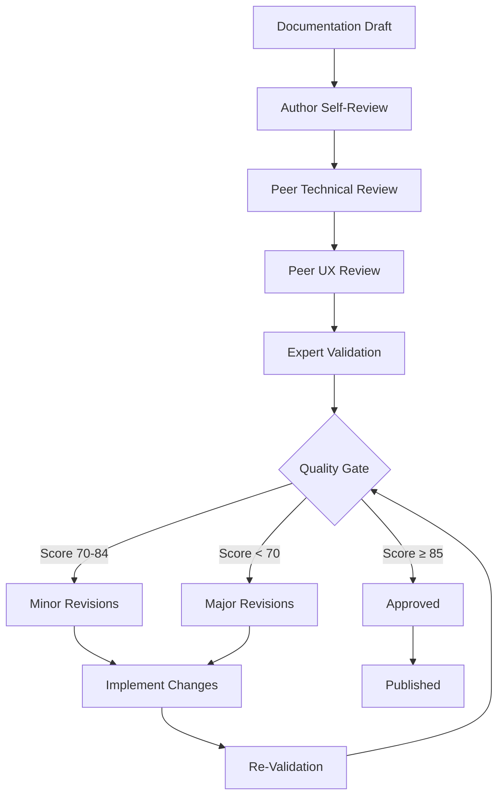

# Agent-Agnostic SSOT Validation Framework

**Version**: 1.0.0  
**Date**: 2025-01-24  
**Purpose**: Ensure consistent quality across all AI-generated documentation

---

## Overview

The Validation Framework provides automated and manual quality assurance processes that work universally across different AI agents and documentation types. It ensures that all generated content meets the SSOT (Single Source of Truth) and Diátaxis framework standards regardless of which AI platform created it.

### Validation Philosophy

- **Universal Standards**: Rules apply to all content regardless of source
- **Automated First**: Automated checks catch common issues instantly
- **Human Oversight**: Expert review validates nuanced quality aspects
- **Continuous Improvement**: Validation rules evolve with the framework
- **Evidence-Based**: All validation criteria are measurable and objective

---

## Core Validation Components

### 1. Structure Validation

#### Directory Structure Compliance
```yaml
validation_rules:
  directory_structure:
    required_dirs:
      - docs/tutorials/
      - docs/how-to-guides/
      - docs/reference/
      - docs/explanation/
      - specs/architecture/
      - specs/features/
      - specs/research/
      - specs/standards/
      - evidence/visual-baselines/
      - evidence/performance/
      - evidence/testing/
      - templates/ssot-templates/
      - templates/diataxis-templates/
      - scripts/
    
    required_files:
      - specs/purpose.md
      - specs/functional_spec.md
      - specs/technical_spec.md
      - README.md
      - .gitignore
    
    naming_conventions:
      files: "snake_case_with_hyphens.md"
      directories: "lowercase_with_hyphens"
      adr_files: "adr_XXX_descriptive_title.md"
```

#### File Structure Validation Script
```python
def validate_directory_structure(project_root: str) -> Dict[str, Any]:
    """Validate directory and file structure compliance"""
    issues = []
    score = 100
    
    required_structure = load_required_structure()
    
    # Check directories
    for dir_path in required_structure['required_dirs']:
        full_path = os.path.join(project_root, dir_path)
        if not os.path.exists(full_path):
            issues.append(f"Missing required directory: {dir_path}")
            score -= 5
    
    # Check files
    for file_path in required_structure['required_files']:
        full_path = os.path.join(project_root, file_path)
        if not os.path.exists(full_path):
            issues.append(f"Missing required file: {file_path}")
            score -= 10
    
    # Check naming conventions
    naming_issues = validate_naming_conventions(project_root)
    issues.extend(naming_issues)
    score -= len(naming_issues) * 2
    
    return {
        "score": max(0, score),
        "issues": issues,
        "compliant": score >= 90
    }
```

### 2. Content Quality Validation

#### Purpose Document Validation
```python
def validate_purpose_document(file_path: str) -> Dict[str, Any]:
    """Comprehensive validation of purpose document"""
    content = read_file(file_path)
    issues = []
    score = 100
    
    # Word count validation
    word_count = len(content.split())
    if word_count > 500:
        issues.append(f"Exceeds 500 word limit: {word_count} words")
        score -= 15
    elif word_count < 200:
        issues.append(f"Too brief: {word_count} words (minimum 200 recommended)")
        score -= 5
    
    # Required sections validation
    required_sections = [
        "Problem Statement",
        "Target Users",
        "Scope",
        "Success Criteria",
        "Key Assumptions",
        "Context & Constraints"
    ]
    
    for section in required_sections:
        if section not in content:
            issues.append(f"Missing required section: {section}")
            score -= 10
    
    # Measurable metrics validation
    success_criteria = extract_section(content, "Success Criteria")
    measurable_count = count_measurable_metrics(success_criteria)
    
    if measurable_count < 3:
        issues.append(f"Insufficient measurable metrics: {measurable_count} (minimum 3 required)")
        score -= 20
    
    # Scope validation
    scope_section = extract_section(content, "Scope")
    inclusions = count_scope_items(scope_section, "Included")
    exclusions = count_scope_items(scope_section, "Excluded")
    
    if inclusions < 5:
        issues.append(f"Insufficient scope inclusions: {inclusions} (minimum 5 required)")
        score -= 10
    
    if exclusions < 5:
        issues.append(f"Insufficient scope exclusions: {exclusions} (minimum 5 required)")
        score -= 10
    
    # Technical terms validation
    undefined_terms = find_undefined_technical_terms(content)
    if undefined_terms:
        issues.append(f"Undefined technical terms: {', '.join(undefined_terms)}")
        score -= len(undefined_terms) * 2
    
    return {
        "score": max(0, score),
        "issues": issues,
        "metrics": {
            "word_count": word_count,
            "measurable_metrics": measurable_count,
            "scope_inclusions": inclusions,
            "scope_exclusions": exclusions,
            "undefined_terms": len(undefined_terms)
        }
    }

def count_measurable_metrics(text: str) -> int:
    """Count metrics with specific, measurable criteria"""
    measurable_patterns = [
        r"reduce.*to\s*<\d+",
        r"achieve\s*\d+%",
        r"maintain\s*≥\d+",
        r"from\s*\d+\s*to\s*<\d+",
        r"≤\d+\s*(?:ms|seconds|minutes|hours)",
        r"≥\d+\s*(?:requests|users|transactions)",
        r"\d+%\s*(?:improvement|reduction|increase)",
        r"<\d+\s*(?:errors|failures|issues)"
    ]
    
    count = 0
    for pattern in measurable_patterns:
        matches = re.findall(pattern, text, re.IGNORECASE)
        count += len(matches)
    
    return count
```

#### Functional Specification Validation
```python
def validate_functional_specification(file_path: str) -> Dict[str, Any]:
    """Validate functional specification quality"""
    content = read_file(file_path)
    issues = []
    score = 100
    
    # User journeys validation
    journeys = extract_user_journeys(content)
    if len(journeys) < 3:
        issues.append(f"Insufficient user journeys: {len(journeys)} (minimum 3 required)")
        score -= 15
    
    # Journey quality validation
    for i, journey in enumerate(journeys):
        if not has_measurable_success_metrics(journey):
            issues.append(f"User Journey {i+1} lacks measurable success metrics")
            score -= 10
        
        if not has_clear_steps(journey):
            issues.append(f"User Journey {i+1} steps are unclear")
            score -= 5
    
    # Acceptance criteria validation
    ac_section = extract_section(content, "Acceptance Criteria")
    if not ac_section:
        issues.append("Missing Acceptance Criteria section")
        score -= 20
    else:
        testable_ac = count_testable_criteria(ac_section)
        total_ac = count_total_criteria(ac_section)
        
        if testable_ac < total_ac * 0.8:
            issues.append(f"Insufficient testable acceptance criteria: {testable_ac}/{total_ac}")
            score -= 15
    
    # Data requirements validation
    if "Data Requirements" not in content:
        issues.append("Missing Data Requirements section")
        score -= 10
    
    # Integration points validation
    if "Integration Points" not in content:
        issues.append("Missing Integration Points section")
        score -= 10
    
    # Cross-reference validation
    if "purpose.md" not in content:
        issues.append("Functional specification should reference purpose.md")
        score -= 5
    
    return {
        "score": max(0, score),
        "issues": issues,
        "metrics": {
            "user_journeys": len(journeys),
            "testable_criteria": testable_ac if 'testable_ac' in locals() else 0,
            "total_criteria": total_ac if 'total_ac' in locals() else 0
        }
    }
```

#### Technical Specification Validation
```python
def validate_technical_specification(file_path: str) -> Dict[str, Any]:
    """Validate technical specification quality"""
    content = read_file(file_path)
    issues = []
    score = 100
    
    # Architecture diagram validation
    if "```mermaid" not in content:
        issues.append("Missing architecture diagram (should use Mermaid)")
        score -= 15
    else:
        # Validate Mermaid syntax
        mermaid_blocks = extract_mermaid_blocks(content)
        for block in mermaid_blocks:
            if not validate_mermaid_syntax(block):
                issues.append("Invalid Mermaid syntax in architecture diagram")
                score -= 10
    
    # Technology stack validation
    tech_stack = extract_section(content, "Technology Stack")
    if not tech_stack:
        issues.append("Missing Technology Stack section")
        score -= 15
    else:
        # Check for version numbers
        if not re.search(r"\d+\.\d+(\.\d+)?", tech_stack):
            issues.append("Technology stack should include specific versions")
            score -= 10
    
    # Performance requirements validation
    perf_section = extract_section(content, "Performance Requirements")
    if not perf_section:
        issues.append("Missing Performance Requirements section")
        score -= 15
    else:
        # Check for measurable performance criteria
        perf_metrics = extract_performance_metrics(perf_section)
        if len(perf_metrics) < 3:
            issues.append(f"Insufficient performance metrics: {len(perf_metrics)} (minimum 3 required)")
            score -= 10
    
    # Security considerations validation
    if "Security" not in content:
        issues.append("Missing Security Considerations section")
        score -= 10
    
    # Component design validation
    if "Component Design" not in content:
        issues.append("Missing Component Design section")
        score -= 10
    
    # Cross-reference validation
    if "functional_spec.md" not in content:
        issues.append("Technical specification should reference functional_spec.md")
        score -= 5
    
    return {
        "score": max(0, score),
        "issues": issues,
        "metrics": {
            "mermaid_diagrams": len(mermaid_blocks) if 'mermaid_blocks' in locals() else 0,
            "performance_metrics": len(perf_metrics) if 'perf_metrics' in locals() else 0
        }
    }
```

### 3. Diátaxis Framework Validation

#### Tutorial Validation
```python
def validate_tutorial(file_path: str) -> Dict[str, Any]:
    """Validate tutorial follows Diátaxis framework"""
    content = read_file(file_path)
    issues = []
    score = 100
    
    # Required sections for tutorials
    required_sections = [
        "Learning Objectives",
        "Prerequisites",
        "Step-by-Step",
        "Summary"
    ]
    
    for section in required_sections:
        if section not in content:
            issues.append(f"Missing required tutorial section: {section}")
            score -= 10
    
    # Learning objectives validation
    objectives = extract_learning_objectives(content)
    if len(objectives) < 3:
        issues.append(f"Insufficient learning objectives: {len(objectives)} (minimum 3 recommended)")
        score -= 10
    
    # Step validation
    steps = extract_steps(content)
    if len(steps) < 5:
        issues.append(f"Tutorial too brief: {len(steps)} steps (minimum 5 recommended)")
        score -= 10
    
    # Actionability validation
    non_actionable_steps = count_non_actionable_steps(steps)
    if non_actionable_steps > 0:
        issues.append(f"{non_actionable_steps} steps are not actionable")
        score -= non_actionable_steps * 5
    
    # Time estimation validation
    if not re.search(r"\d+\s*minutes?", content):
        issues.append("Tutorial should include estimated completion time")
        score -= 5
    
    # Exercise validation
    if "Exercise" not in content and "Practice" not in content:
        issues.append("Tutorial should include practice exercises")
        score -= 10
    
    return {
        "score": max(0, score),
        "issues": issues,
        "metrics": {
            "learning_objectives": len(objectives),
            "steps": len(steps),
            "non_actionable_steps": non_actionable_steps
        }
    }
```

#### How-To Guide Validation
```python
def validate_how_to_guide(file_path: str) -> Dict[str, Any]:
    """Validate how-to guide follows Diátaxis framework"""
    content = read_file(file_path)
    issues = []
    score = 100
    
    # Problem focus validation
    if not re.search(r"(?:Problem|Issue|Challenge|Goal)", content, re.IGNORECASE):
        issues.append("How-to guide should clearly state the problem or goal")
        score -= 10
    
    # Prerequisites validation
    if "Prerequisites" not in content and "What you'll need" not in content:
        issues.append("How-to guide should include prerequisites")
        score -= 10
    
    # Step specificity validation
    steps = extract_steps(content)
    vague_steps = count_vague_steps(steps)
    if vague_steps > 0:
        issues.append(f"{vague_steps} steps are too vague or general")
        score -= vague_steps * 5
    
    # Verification validation
    if not re.search(r"(?:Verify|Check|Confirm|Test)", content, re.IGNORECASE):
        issues.append("How-to guide should include verification steps")
        score -= 10
    
    # Expected outcome validation
    if "Result" not in content and "Outcome" not in content and "Expected" not in content:
        issues.append("How-to guide should specify expected outcomes")
        score -= 10
    
    # Troubleshooting validation
    if "Troubleshoot" not in content and "Issue" not in content and "Problem" not in content:
        issues.append("How-to guide should include troubleshooting tips")
        score -= 5
    
    # Time estimation validation
    if not re.search(r"\d+\s*minutes?", content):
        issues.append("How-to guide should include estimated completion time")
        score -= 5
    
    return {
        "score": max(0, score),
        "issues": issues,
        "metrics": {
            "steps": len(steps),
            "vague_steps": vague_steps
        }
    }
```

#### Reference Material Validation
```python
def validate_reference_material(file_path: str) -> Dict[str, Any]:
    """Validate reference material follows Diátaxis framework"""
    content = read_file(file_path)
    issues = []
    score = 100
    
    # Structure validation
    if not re.search(r"(?:##\s+|\*\*\*)", content):
        issues.append("Reference material should have clear section structure")
        score -= 10
    
    # Completeness validation
    # For API reference, check endpoints
    if "API" in content or "endpoint" in content:
        endpoints = extract_api_endpoints(content)
        if len(endpoints) < 3:
            issues.append(f"API reference incomplete: {len(endpoints)} endpoints")
            score -= 15
        
        # Check for examples
        examples = count_code_examples(content)
        if examples < len(endpoints):
            issues.append(f"Insufficient examples: {examples} for {len(endpoints)} endpoints")
            score -= 10
    
    # Accuracy validation
    if re.search(r"(?:TODO|FIXME|TBD)", content, re.IGNORECASE):
        issues.append("Reference material contains placeholders")
        score -= 10
    
    # Consistency validation
    formatting_issues = check_formatting_consistency(content)
    if formatting_issues:
        issues.extend(formatting_issues)
        score -= len(formatting_issues) * 5
    
    # Searchability validation
    if not re.search(r"(?:Parameters|Arguments|Options|Returns)", content, re.IGNORECASE):
        issues.append("Reference material should include parameter/return documentation")
        score -= 10
    
    return {
        "score": max(0, score),
        "issues": issues,
        "metrics": {
            "endpoints": len(endpoints) if 'endpoints' in locals() else 0,
            "examples": examples if 'examples' in locals() else 0,
            "formatting_issues": len(formatting_issues) if 'formatting_issues' in locals() else 0
        }
    }
```

#### Explanation Documentation Validation
```python
def validate_explanation_documentation(file_path: str) -> Dict[str, Any]:
    """Validate explanation follows Diátaxis framework"""
    content = read_file(file_path)
    issues = []
    score = 100
    
    # Concept clarity validation
    if not re.search(r"(?:What is|Definition|Concept)", content, re.IGNORECASE):
        issues.append("Explanation should define the concept clearly")
        score -= 10
    
    # Context validation
    if not re.search(r"(?:Why|Because|Reason|Background)", content, re.IGNORECASE):
        issues.append("Explanation should provide context and motivation")
        score -= 10
    
    # Analogy validation
    if not re.search(r"(?:Analogy|Like|Similar|Compare)", content, re.IGNORECASE):
        issues.append("Explanation should include analogies or comparisons")
        score -= 5
    
    # Misconceptions validation
    if not re.search(r"(?:Misconception|Common mistake|Not)", content, re.IGNORECASE):
        issues.append("Explanation should address common misconceptions")
        score -= 10
    
    # Practical application validation
    if not re.search(r"(?:Example|Use case|Application|Practice)", content, re.IGNORECASE):
        issues.append("Explanation should include practical applications")
        score -= 10
    
    # Related concepts validation
    if not re.search(r"(?:Related|See also|Connection)", content, re.IGNORECASE):
        issues.append("Explanation should reference related concepts")
        score -= 5
    
    # Technical depth validation
    if len(content.split()) < 300:
        issues.append("Explanation too brief for comprehensive understanding")
        score -= 10
    
    return {
        "score": max(0, score),
        "issues": issues,
        "metrics": {
            "word_count": len(content.split()),
            "has_analogy": bool(re.search(r"(?:Analogy|Like|Similar)", content, re.IGNORECASE)),
            "addresses_misconceptions": bool(re.search(r"(?:Misconception|Common mistake)", content, re.IGNORECASE))
        }
    }
```

### 4. Cross-Reference Validation

#### Link and Reference Validation
```python
def validate_cross_references(project_root: str) -> Dict[str, Any]:
    """Validate all internal links and references"""
    issues = []
    score = 100
    
    # Find all markdown files
    md_files = find_markdown_files(project_root)
    
    # Extract all internal links
    all_links = {}
    for file_path in md_files:
        content = read_file(file_path)
        links = extract_internal_links(content, file_path)
        all_links[file_path] = links
    
    # Validate each link
    broken_links = []
    for file_path, links in all_links.items():
        for link in links:
            if not is_valid_link(link, project_root):
                broken_links.append({
                    "source": file_path,
                    "target": link,
                    "type": "broken"
                })
                score -= 5
    
    # Check for orphaned files
    referenced_files = set()
    for links in all_links.values():
        for link in links:
            if link.endswith('.md'):
                referenced_files.add(os.path.normpath(link))
    
    all_md_files = set(os.path.relpath(f, project_root) for f in md_files)
    orphaned_files = all_md_files - referenced_files - set(['README.md'])
    
    for orphan in orphaned_files:
        issues.append(f"Orphaned file with no incoming references: {orphan}")
        score -= 3
    
    # Validate ADR numbering
    adr_issues = validate_adr_numbering(project_root)
    issues.extend(adr_issues)
    score -= len(adr_issues) * 5
    
    # Validate feature ID consistency
    feature_issues = validate_feature_ids(project_root)
    issues.extend(feature_issues)
    score -= len(feature_issues) * 3
    
    return {
        "score": max(0, score),
        "issues": issues,
        "broken_links": broken_links,
        "orphaned_files": list(orphaned_files),
        "total_links": sum(len(links) for links in all_links.values())
    }

def validate_adr_numbering(project_root: str) -> List[str]:
    """Validate ADR files are numbered sequentially"""
    issues = []
    adr_dir = os.path.join(project_root, "specs", "architecture")
    
    if not os.path.exists(adr_dir):
        return issues
    
    adr_files = [f for f in os.listdir(adr_dir) if f.startswith("adr_") and f.endswith(".md")]
    
    # Extract numbers and check sequence
    numbers = []
    for filename in adr_files:
        match = re.match(r"adr_(\d+)_", filename)
        if match:
            numbers.append(int(match.group(1)))
        else:
            issues.append(f"Invalid ADR filename format: {filename}")
    
    numbers.sort()
    for i, expected in enumerate(range(1, len(numbers) + 1)):
        if i < len(numbers) and numbers[i] != expected:
            issues.append(f"ADR sequence gap: expected ADR-{expected:03d}, found ADR-{numbers[i]:03d}")
    
    return issues
```

### 5. Quality Metrics Calculation

#### Overall Quality Score
```python
def calculate_overall_quality_score(validation_results: Dict[str, Any]) -> Dict[str, Any]:
    """Calculate comprehensive quality score"""
    
    # Weight different validation categories
    weights = {
        "structure": 0.20,
        "content": 0.35,
        "diataxis": 0.25,
        "cross_references": 0.20
    }
    
    weighted_scores = {}
    for category, weight in weights.items():
        score = validation_results.get(category, {}).get("score", 0)
        weighted_scores[category] = score * weight
    
    overall_score = sum(weighted_scores.values())
    
    # Determine quality level
    if overall_score >= 95:
        quality_level = "Excellent"
    elif overall_score >= 85:
        quality_level = "Good"
    elif overall_score >= 70:
        quality_level = "Acceptable"
    elif overall_score >= 50:
        quality_level = "Needs Improvement"
    else:
        quality_level = "Poor"
    
    return {
        "overall_score": round(overall_score, 1),
        "quality_level": quality_level,
        "weighted_scores": weighted_scores,
        "recommendations": generate_recommendations(validation_results)
    }

def generate_recommendations(validation_results: Dict[str, Any]) -> List[str]:
    """Generate specific improvement recommendations"""
    recommendations = []
    
    # Structure recommendations
    structure_score = validation_results.get("structure", {}).get("score", 100)
    if structure_score < 90:
        recommendations.append("Complete directory structure setup and ensure all required files are present")
    
    # Content recommendations
    content_issues = validation_results.get("content", {}).get("issues", [])
    if any("measurable" in issue.lower() for issue in content_issues):
        recommendations.append("Add specific, measurable metrics to success criteria and requirements")
    
    if any("section" in issue.lower() for issue in content_issues):
        recommendations.append("Ensure all required sections are present and complete")
    
    # Diátaxis recommendations
    diataxis_score = validation_results.get("diataxis", {}).get("score", 100)
    if diataxis_score < 80:
        recommendations.append("Review and improve user documentation to better follow Diátaxis framework principles")
    
    # Cross-reference recommendations
    broken_links = validation_results.get("cross_references", {}).get("broken_links", [])
    if broken_links:
        recommendations.append(f"Fix {len(broken_links)} broken internal links and references")
    
    return recommendations
```

---

## Automated Validation Implementation

### 1. Validation Script Suite

#### Main Validation Orchestrator
```python
#!/usr/bin/env python3
"""
SSOT Validation Framework - Main Validator
Works with any AI-generated documentation
"""

import os
import sys
import json
import argparse
from pathlib import Path
from typing import Dict, Any, List

class SSOTValidationFramework:
    def __init__(self, project_root: str = "."):
        self.project_root = Path(project_root).resolve()
        self.results = {}
        
    def run_full_validation(self) -> Dict[str, Any]:
        """Run complete validation suite"""
        print("🔍 Starting SSOT Validation Framework...")
        
        # Initialize results
        self.results = {
            "timestamp": datetime.now().isoformat(),
            "project_root": str(self.project_root),
            "validation_categories": {}
        }
        
        # Run validation categories
        categories = [
            ("structure", self.validate_structure),
            ("content", self.validate_content),
            ("diataxis", self.validate_diataxis),
            ("cross_references", self.validate_cross_references)
        ]
        
        for category_name, validator in categories:
            print(f"\n📋 Validating {category_name.replace('_', ' ').title()}...")
            try:
                result = validator()
                self.results["validation_categories"][category_name] = result
                print(f"   Score: {result['score']}/100")
                
                if result.get('issues'):
                    print(f"   Issues: {len(result['issues'])}")
                    for issue in result['issues'][:3]:  # Show first 3
                        print(f"     - {issue}")
                    if len(result['issues']) > 3:
                        print(f"     ... and {len(result['issues']) - 3} more")
                        
            except Exception as e:
                print(f"   ❌ Error in {category_name}: {e}")
                self.results["validation_categories"][category_name] = {
                    "score": 0,
                    "error": str(e),
                    "issues": [f"Validation error: {e}"]
                }
        
        # Calculate overall score
        overall_result = calculate_overall_quality_score(
            self.results["validation_categories"]
        )
        self.results.update(overall_result)
        
        # Print summary
        self.print_summary()
        
        return self.results
    
    def validate_structure(self) -> Dict[str, Any]:
        """Validate directory and file structure"""
        return validate_directory_structure(str(self.project_root))
    
    def validate_content(self) -> Dict[str, Any]:
        """Validate content quality of specifications"""
        content_results = {
            "score": 100,
            "issues": [],
            "file_results": {}
        }
        
        # Validate purpose document
        purpose_path = self.project_root / "specs" / "purpose.md"
        if purpose_path.exists():
            result = validate_purpose_document(str(purpose_path))
            content_results["file_results"]["purpose.md"] = result
            content_results["score"] = min(content_results["score"], result["score"])
            content_results["issues"].extend([f"purpose.md: {issue}" for issue in result["issues"]])
        else:
            content_results["issues"].append("Missing purpose.md")
            content_results["score"] -= 30
        
        # Validate functional specification
        func_spec_path = self.project_root / "specs" / "functional_spec.md"
        if func_spec_path.exists():
            result = validate_functional_specification(str(func_spec_path))
            content_results["file_results"]["functional_spec.md"] = result
            content_results["score"] = min(content_results["score"], result["score"])
            content_results["issues"].extend([f"functional_spec.md: {issue}" for issue in result["issues"]])
        else:
            content_results["issues"].append("Missing functional_spec.md")
            content_results["score"] -= 30
        
        # Validate technical specification
        tech_spec_path = self.project_root / "specs" / "technical_spec.md"
        if tech_spec_path.exists():
            result = validate_technical_specification(str(tech_spec_path))
            content_results["file_results"]["technical_spec.md"] = result
            content_results["score"] = min(content_results["score"], result["score"])
            content_results["issues"].extend([f"technical_spec.md: {issue}" for issue in result["issues"]])
        else:
            content_results["issues"].append("Missing technical_spec.md")
            content_results["score"] -= 30
        
        content_results["score"] = max(0, content_results["score"])
        return content_results
    
    def validate_diataxis(self) -> Dict[str, Any]:
        """Validate Diátaxis framework compliance"""
        diataxis_results = {
            "score": 100,
            "issues": [],
            "file_results": {}
        }
        
        # Find documentation files
        docs_dir = self.project_root / "docs"
        if not docs_dir.exists():
            diataxis_results["issues"].append("Missing docs directory")
            diataxis_results["score"] = 50
            return diataxis_results
        
        # Validate tutorials
        tutorials_dir = docs_dir / "tutorials"
        if tutorials_dir.exists():
            for tutorial_file in tutorials_dir.glob("*.md"):
                result = validate_tutorial(str(tutorial_file))
                diataxis_results["file_results"][tutorial_file.name] = result
                diataxis_results["score"] = min(diataxis_results["score"], result["score"])
                diataxis_results["issues"].extend([f"{tutorial_file.name}: {issue}" for issue in result["issues"]])
        
        # Validate how-to guides
        howto_dir = docs_dir / "how-to-guides"
        if howto_dir.exists():
            for howto_file in howto_dir.glob("*.md"):
                result = validate_how_to_guide(str(howto_file))
                diataxis_results["file_results"][howto_file.name] = result
                diataxis_results["score"] = min(diataxis_results["score"], result["score"])
                diataxis_results["issues"].extend([f"{howto_file.name}: {issue}" for issue in result["issues"]])
        
        # Validate reference material
        reference_dir = docs_dir / "reference"
        if reference_dir.exists():
            for reference_file in reference_dir.glob("*.md"):
                result = validate_reference_material(str(reference_file))
                diataxis_results["file_results"][reference_file.name] = result
                diataxis_results["score"] = min(diataxis_results["score"], result["score"])
                diataxis_results["issues"].extend([f"{reference_file.name}: {issue}" for issue in result["issues"]])
        
        # Validate explanations
        explanation_dir = docs_dir / "explanation"
        if explanation_dir.exists():
            for explanation_file in explanation_dir.glob("*.md"):
                result = validate_explanation_documentation(str(explanation_file))
                diataxis_results["file_results"][explanation_file.name] = result
                diataxis_results["score"] = min(diataxis_results["score"], result["score"])
                diataxis_results["issues"].extend([f"{explanation_file.name}: {issue}" for issue in result["issues"]])
        
        diataxis_results["score"] = max(0, diataxis_results["score"])
        return diataxis_results
    
    def validate_cross_references(self) -> Dict[str, Any]:
        """Validate internal links and references"""
        return validate_cross_references(str(self.project_root))
    
    def print_summary(self):
        """Print validation summary"""
        print(f"\n🎯 VALIDATION SUMMARY")
        print(f"Overall Score: {self.results['overall_score']}/100 ({self.results['quality_level']})")
        
        print(f"\n📊 Category Scores:")
        for category, result in self.results["validation_categories"].items():
            score = result.get("score", 0)
            status = "✅" if score >= 90 else "⚠️" if score >= 70 else "❌"
            print(f"  {status} {category.replace('_', ' ').title()}: {score}/100")
        
        if self.results.get("recommendations"):
            print(f"\n💡 Recommendations:")
            for i, rec in enumerate(self.results["recommendations"], 1):
                print(f"  {i}. {rec}")
        
        # Exit with error code if score is too low
        if self.results["overall_score"] < 70:
            print(f"\n❌ Validation FAILED - Score below acceptable threshold")
            sys.exit(1)
        elif self.results["overall_score"] < 85:
            print(f"\n⚠️  Validation PASSED with issues - Consider improvements")
        else:
            print(f"\n✅ Validation PASSED - High quality documentation")

def main():
    parser = argparse.ArgumentParser(description="SSOT Validation Framework")
    parser.add_argument("--project-root", default=".", help="Project root directory")
    parser.add_argument("--output", choices=["text", "json"], default="text", help="Output format")
    parser.add_argument("--verbose", "-v", action="store_true", help="Verbose output")
    parser.add_argument("--category", choices=["structure", "content", "diataxis", "cross_references"], 
                       help="Run specific validation category")
    
    args = parser.parse_args()
    
    validator = SSOTValidationFramework(args.project_root)
    
    if args.category:
        # Run specific category
        if args.category == "structure":
            result = validator.validate_structure()
        elif args.category == "content":
            result = validator.validate_content()
        elif args.category == "diataxis":
            result = validator.validate_diataxis()
        elif args.category == "cross_references":
            result = validator.validate_cross_references()
        
        if args.output == "json":
            print(json.dumps(result, indent=2))
        else:
            print(f"{args.category.title()} Validation: {result['score']}/100")
            if result.get('issues'):
                for issue in result['issues']:
                    print(f"  - {issue}")
    else:
        # Run full validation
        results = validator.run_full_validation()
        
        if args.output == "json":
            print(json.dumps(results, indent=2))
        
        # Save results to file
        results_file = Path(args.project_root) / "validation-results.json"
        with open(results_file, 'w') as f:
            json.dump(results, f, indent=2)
        print(f"\n📁 Detailed results saved to: {results_file}")

if __name__ == "__main__":
    main()
```

### 2. Continuous Integration Integration

#### GitHub Actions Workflow
```yaml
# .github/workflows/ssot-validation.yml
name: SSOT Documentation Validation

on:
  push:
    branches: [ main, develop ]
    paths: [ 'docs/**', 'specs/**', 'templates/**' ]
  pull_request:
    branches: [ main ]
    paths: [ 'docs/**', 'specs/**', 'templates/**' ]

jobs:
  validate-documentation:
    runs-on: ubuntu-latest
    
    steps:
    - name: Checkout repository
      uses: actions/checkout@v4
    
    - name: Set up Python
      uses: actions/setup-python@v4
      with:
        python-version: '3.9'
    
    - name: Install validation dependencies
      run: |
        python -m pip install --upgrade pip
        pip install pyyaml markdown
    
    - name: Run SSOT Validation Framework
      run: |
        python scripts/validate_ssot.py --output json --verbose
        
    - name: Check Quality Gates
      run: |
        # Check overall score
        SCORE=$(python -c "
        import json
        with open('validation-results.json') as f:
            results = json.load(f)
        print(results['overall_score'])
        ")
        
        echo "Validation score: $SCORE"
        
        # Quality gates
        if [ $(echo "$SCORE < 70" | bc -l) -eq 1 ]; then
          echo "❌ FAILED: Score below minimum threshold (70)"
          exit 1
        elif [ $(echo "$SCORE < 85" | bc -l) -eq 1 ]; then
          echo "⚠️  WARNING: Score below good threshold (85)"
        else
          echo "✅ PASSED: High quality documentation"
        fi
        
        # Check critical categories
        STRUCTURE_SCORE=$(python -c "
        import json
        with open('validation-results.json') as f:
            results = json.load(f)
        print(results['validation_categories']['structure']['score'])
        ")
        
        if [ $(echo "$STRUCTURE_SCORE < 90" | bc -l) -eq 1 ]; then
          echo "❌ FAILED: Structure score below threshold (90)"
          exit 1
        fi
    
    - name: Generate Validation Report
      run: |
        python scripts/generate_validation_report.py
        
    - name: Upload Validation Results
      uses: actions/upload-artifact@v3
      with:
        name: validation-results
        path: |
          validation-results.json
          validation-report.html
        retention-days: 30
    
    - name: Comment PR with Results
      if: github.event_name == 'pull_request'
      uses: actions/github-script@v6
      with:
        script: |
          const fs = require('fs');
          const results = JSON.parse(fs.readFileSync('validation-results.json', 'utf8'));
          
          const comment = `
          ## 📊 SSOT Validation Results
          
          **Overall Score**: ${results.overall_score}/100 (${results.quality_level})
          
          ### Category Scores:
          - 📁 Structure: ${results.validation_categories.structure.score}/100
          - 📝 Content: ${results.validation_categories.content.score}/100
          - 📚 Diátaxis: ${results.validation_categories.diataxis.score}/100
          - 🔗 Cross-References: ${results.validation_categories.cross_references.score}/100
          
          ${results.overall_score >= 85 ? '✅ **PASSED** - High quality documentation' : 
            results.overall_score >= 70 ? '⚠️ **PASSED** - Needs improvements' : 
            '❌ **FAILED** - Quality below threshold'}
          
          ${results.recommendations.length > 0 ? `
          ### 💡 Recommendations:
          ${results.recommendations.map(r => `- ${r}`).join('\n')}
          ` : ''}
          `;
          
          github.rest.issues.createComment({
            issue_number: context.issue.number,
            owner: context.repo.owner,
            repo: context.repo.repo,
            body: comment
          });
```

### 3. Quality Metrics Dashboard

#### Metrics Collection Script
```python
# scripts/collect_quality_metrics.py
import json
import sqlite3
from datetime import datetime, timedelta
from pathlib import Path

class QualityMetricsCollector:
    def __init__(self, db_path: str = "quality-metrics.db"):
        self.db_path = db_path
        self.init_database()
    
    def init_database(self):
        """Initialize metrics database"""
        conn = sqlite3.connect(self.db_path)
        cursor = conn.cursor()
        
        cursor.execute('''
            CREATE TABLE IF NOT EXISTS validation_results (
                id INTEGER PRIMARY KEY AUTOINCREMENT,
                timestamp TEXT NOT NULL,
                project_root TEXT NOT NULL,
                overall_score REAL NOT NULL,
                quality_level TEXT NOT NULL,
                structure_score REAL NOT NULL,
                content_score REAL NOT NULL,
                diataxis_score REAL NOT NULL,
                cross_references_score REAL NOT NULL,
                total_issues INTEGER NOT NULL,
                git_commit TEXT,
                branch TEXT
            )
        ''')
        
        cursor.execute('''
            CREATE TABLE IF NOT EXISTS file_metrics (
                id INTEGER PRIMARY KEY AUTOINCREMENT,
                timestamp TEXT NOT NULL,
                file_path TEXT NOT NULL,
                file_type TEXT NOT NULL,
                score REAL NOT NULL,
                issue_count INTEGER NOT NULL,
                word_count INTEGER,
                measurable_metrics INTEGER
            )
        ''')
        
        conn.commit()
        conn.close()
    
    def collect_metrics(self, validation_results: Dict[str, Any], git_info: Dict[str, str] = None):
        """Collect and store validation metrics"""
        conn = sqlite3.connect(self.db_path)
        cursor = conn.cursor()
        
        # Store overall results
        cursor.execute('''
            INSERT INTO validation_results 
            (timestamp, project_root, overall_score, quality_level, 
             structure_score, content_score, diataxis_score, cross_references_score,
             total_issues, git_commit, branch)
            VALUES (?, ?, ?, ?, ?, ?, ?, ?, ?, ?, ?)
        ''', (
            validation_results["timestamp"],
            validation_results["project_root"],
            validation_results["overall_score"],
            validation_results["quality_level"],
            validation_results["validation_categories"]["structure"]["score"],
            validation_results["validation_categories"]["content"]["score"],
            validation_results["validation_categories"]["diataxis"]["score"],
            validation_results["validation_categories"]["cross_references"]["score"],
            sum(len(cat.get("issues", [])) for cat in validation_results["validation_categories"].values()),
            git_info.get("commit") if git_info else None,
            git_info.get("branch") if git_info else None
        ))
        
        # Store file-level metrics
        for category, results in validation_results["validation_categories"].items():
            if "file_results" in results:
                for file_name, file_result in results["file_results"].items():
                    cursor.execute('''
                        INSERT INTO file_metrics 
                        (timestamp, file_path, file_type, score, issue_count, word_count, measurable_metrics)
                        VALUES (?, ?, ?, ?, ?, ?, ?)
                    ''', (
                        validation_results["timestamp"],
                        file_name,
                        category,
                        file_result.get("score", 0),
                        len(file_result.get("issues", [])),
                        file_result.get("metrics", {}).get("word_count"),
                        file_result.get("metrics", {}).get("measurable_metrics")
                    ))
        
        conn.commit()
        conn.close()
    
    def generate_trend_report(self, days: int = 30) -> Dict[str, Any]:
        """Generate quality trend report"""
        conn = sqlite3.connect(self.db_path)
        cursor = conn.cursor()
        
        since_date = (datetime.now() - timedelta(days=days)).isoformat()
        
        # Get trend data
        cursor.execute('''
            SELECT timestamp, overall_score, quality_level, total_issues
            FROM validation_results 
            WHERE timestamp > ?
            ORDER BY timestamp
        ''', (since_date,))
        
        trend_data = cursor.fetchall()
        
        # Calculate averages
        cursor.execute('''
            SELECT 
                AVG(overall_score) as avg_score,
                MIN(overall_score) as min_score,
                MAX(overall_score) as max_score,
                COUNT(*) as total_validations
            FROM validation_results 
            WHERE timestamp > ?
        ''', (since_date,))
        
        stats = cursor.fetchone()
        
        conn.close()
        
        return {
            "period_days": days,
            "total_validations": stats[3],
            "average_score": round(stats[0], 1) if stats[0] else 0,
            "min_score": stats[1] if stats[1] else 0,
            "max_score": stats[2] if stats[2] else 0,
            "trend_data": [
                {
                    "timestamp": row[0],
                    "score": row[1],
                    "quality_level": row[2],
                    "issues": row[3]
                }
                for row in trend_data
            ]
        }
```

---

## Manual Validation Processes

### 1. Expert Review Checklist

#### Technical Accuracy Review
```markdown
## Technical Accuracy Review Checklist

### Content Verification
- [ ] All technical specifications match actual implementation
- [ ] Code examples compile and run correctly
- [ ] API endpoints and parameters are accurate
- [ ] Performance benchmarks are realistic and achievable
- [ ] Security requirements are comprehensive and current

### Consistency Check
- [ ] Terminology is consistent across all documents
- [ ] Cross-references point to correct sections
- [ ] Version numbers are accurate and synchronized
- [ ] Diagrams match textual descriptions
- [ ] Examples follow established patterns

### Completeness Assessment
- [ ] All major features are documented
- [ ] Edge cases and error conditions are covered
- [ ] Integration points are clearly explained
- [ ] Dependencies and prerequisites are listed
- [ ] Troubleshooting information is comprehensive

### Validation Results
**Overall Score**: ___/100
**Critical Issues**: ___
**Recommendations**: 
[List specific improvements needed]
```

#### User Experience Review
```markdown
## User Experience Review Checklist

### Learning Effectiveness (Tutorials)
- [ ] Learning objectives are clear and achievable
- [ ] Progression is logical and builds on previous concepts
- [ ] Practice exercises reinforce learning
- [ ] Estimated time requirements are accurate
- [ ] Prerequisites are appropriate and complete

### Problem Solving (How-To Guides)
- [ ] Problems are relevant to user needs
- [ ] Solutions are complete and actionable
- [ ] Steps are ordered logically
- [ ] Verification steps confirm success
- [ ] Troubleshooting addresses common issues

### Information Access (Reference Material)
- [ ] Information is comprehensive and accurate
- [ ] Structure supports quick lookup
- [ ] Search terms and keywords are included
- [ ] Examples cover common use cases
- [ ] Related information is cross-referenced

### Understanding (Explanations)
- [ ] Concepts are explained clearly
- [ ] Analogies and examples aid understanding
- [ ] Context and motivation are provided
- [ ] Misconceptions are addressed
- [ ] Connections to other concepts are made

### Usability Assessment
**Navigation Score**: ___/10
**Clarity Score**: ___/10
**Completeness Score**: ___/10
**Overall UX Score**: ___/10
```

### 2. Peer Review Process

#### Review Workflow


#### Review Guidelines
```python
# scripts/peer_review.py
class PeerReviewManager:
    def __init__(self):
        self.review_criteria = {
            "technical_accuracy": {
                "weight": 0.30,
                "questions": [
                    "Are all technical details accurate?",
                    "Do code examples work correctly?",
                    "Are specifications consistent with implementation?"
                ]
            },
            "content_quality": {
                "weight": 0.25,
                "questions": [
                    "Is content clear and unambiguous?",
                    "Are success criteria measurable?",
                    "Is the structure logical and complete?"
                ]
            },
            "user_experience": {
                "weight": 0.25,
                "questions": [
                    "Is the documentation easy to navigate?",
                    "Are examples practical and helpful?",
                    " is the language appropriate for the target audience?"
                ]
            },
            "framework_compliance": {
                "weight": 0.20,
                "questions": [
                    "Does it follow SSOT principles?",
                    "Is Diátaxis framework applied correctly?",
                    "Are all templates and standards followed?"
                ]
            }
        }
    
    def conduct_review(self, documentation_path: str, reviewer_role: str) -> Dict[str, Any]:
        """Conduct structured peer review"""
        review_results = {
            "documentation_path": documentation_path,
            "reviewer_role": reviewer_role,
            "timestamp": datetime.now().isoformat(),
            "category_scores": {},
            "overall_score": 0,
            "recommendations": []
        }
        
        # Load documentation content
        content = load_documentation(documentation_path)
        
        # Review each category
        for category, criteria in self.review_criteria.items():
            score = self._assess_category(content, category, criteria["questions"])
            review_results["category_scores"][category] = {
                "score": score,
                "weight": criteria["weight"],
                "weighted_score": score * criteria["weight"]
            }
        
        # Calculate overall score
        review_results["overall_score"] = sum(
            cat["weighted_score"] for cat in review_results["category_scores"].values()
        )
        
        # Generate recommendations
        review_results["recommendations"] = self._generate_recommendations(
            review_results["category_scores"]
        )
        
        return review_results
    
    def _assess_category(self, content: str, category: str, questions: List[str]) -> float:
        """Assess a specific review category"""
        # Implementation would include specific assessment logic
        # For now, return a placeholder
        return 85.0  # Placeholder score
```

---

## Quality Gates and Thresholds

### 1. Quality Gate Definitions

#### Gate Thresholds
```yaml
quality_gates:
  excellent:
    overall_score: 95
    category_minima:
      structure: 95
      content: 95
      diataxis: 90
      cross_references: 95
    description: "Exceptional quality documentation suitable for external publication"
  
  good:
    overall_score: 85
    category_minima:
      structure: 90
      content: 85
      diataxis: 80
      cross_references: 85
    description: "High quality documentation ready for production use"
  
  acceptable:
    overall_score: 70
    category_minima:
      structure: 80
      content: 70
      diataxis: 65
      cross_references: 70
    description: "Adequate documentation requiring minor improvements"
  
  needs_improvement:
    overall_score: 50
    category_minima:
      structure: 70
      content: 50
      diataxis: 45
      cross_references: 50
    description: "Documentation requiring significant improvements"
  
  poor:
    overall_score: 0
    category_minima:
      structure: 0
      content: 0
      diataxis: 0
      cross_references: 0
    description: "Documentation requiring complete overhaul"
```

#### Gate Enforcement
```python
def enforce_quality_gates(validation_results: Dict[str, Any], 
                         required_level: str = "acceptable") -> Dict[str, Any]:
    """Enforce quality gates and return pass/fail result"""
    
    gate_thresholds = QUALITY_GATES[required_level]
    overall_score = validation_results["overall_score"]
    
    # Check overall score
    if overall_score < gate_thresholds["overall_score"]:
        return {
            "passed": False,
            "reason": f"Overall score {overall_score} below required {gate_thresholds['overall_score']}",
            "required_level": required_level,
            "actual_score": overall_score
        }
    
    # Check category minima
    categories = validation_results["validation_categories"]
    for category, minimum in gate_thresholds["category_minima"].items():
        category_score = categories.get(category, {}).get("score", 0)
        if category_score < minimum:
            return {
                "passed": False,
                "reason": f"Category '{category}' score {category_score} below required {minimum}",
                "required_level": required_level,
                "failed_category": category,
                "actual_score": category_score,
                "required_minimum": minimum
            }
    
    return {
        "passed": True,
        "reason": f"Passed {required_level} quality gate",
        "required_level": required_level,
        "actual_score": overall_score
    }
```

### 2. Continuous Quality Monitoring

#### Quality Trend Analysis
```python
def analyze_quality_trends(metrics_history: List[Dict[str, Any]]) -> Dict[str, Any]:
    """Analyze quality trends over time"""
    
    if len(metrics_history) < 2:
        return {"trend": "insufficient_data"}
    
    # Calculate trend direction
    recent_scores = [entry["overall_score"] for entry in metrics_history[-5:]]
    older_scores = [entry["overall_score"] for entry in metrics_history[-10:-5]] if len(metrics_history) >= 10 else []
    
    recent_avg = sum(recent_scores) / len(recent_scores)
    
    if older_scores:
        older_avg = sum(older_scores) / len(older_scores)
        trend_direction = "improving" if recent_avg > older_avg else "declining"
        trend_magnitude = abs(recent_avg - older_avg)
    else:
        trend_direction = "stable"
        trend_magnitude = 0
    
    # Identify patterns
    patterns = []
    
    # Check for consistent improvement
    if all(recent_scores[i] <= recent_scores[i+1] for i in range(len(recent_scores)-1)):
        patterns.append("consistent_improvement")
    
    # Check for consistent decline
    if all(recent_scores[i] >= recent_scores[i+1] for i in range(len(recent_scores)-1)):
        patterns.append("consistent_decline")
    
    # Check for volatility
    if max(recent_scores) - min(recent_scores) > 20:
        patterns.append("high_volatility")
    
    # Check for stability
    if max(recent_scores) - min(recent_scores) < 5:
        patterns.append("high_stability")
    
    return {
        "trend_direction": trend_direction,
        "trend_magnitude": round(trend_magnitude, 1),
        "recent_average": round(recent_avg, 1),
        "patterns": patterns,
        "recommendations": generate_trend_recommendations(trend_direction, patterns)
    }

def generate_trend_recommendations(trend_direction: str, patterns: List[str]) -> List[str]:
    """Generate recommendations based on quality trends"""
    recommendations = []
    
    if trend_direction == "declining":
        recommendations.append("Quality is declining - investigate root causes and implement corrective actions")
        recommendations.append("Consider additional training for documentation authors")
        recommendations.append("Review and update templates and standards")
    
    if "consistent_improvement" in patterns:
        recommendations.append("Excellent consistent improvement - document and share best practices")
    
    if "consistent_decline" in patterns:
        recommendations.append("Urgent: Consistent decline detected - immediate intervention required")
    
    if "high_volatility" in patterns:
        recommendations.append("High volatility in quality scores - standardize processes and provide better guidance")
    
    if "high_stability" in patterns and trend_direction == "stable":
        recommendations.append("Good stability - consider raising quality standards")
    
    return recommendations
```

---

## Conclusion

The Agent-Agnostic SSOT Validation Framework provides comprehensive quality assurance that works universally across different AI agents and documentation types. It ensures:

### Key Benefits

1. **Universal Quality Standards**: Consistent validation regardless of AI platform
2. **Automated Efficiency**: Fast, objective validation of common issues
3. **Continuous Improvement**: Trend analysis and quality monitoring
4. **Team Collaboration**: Structured review processes and clear guidelines
5. **Quality Gates**: Enforceable thresholds for documentation release

### Implementation Success Factors

- **Start Automated**: Implement automated validation first
- **Define Clear Standards**: Establish quality thresholds early
- **Train the Team**: Ensure everyone understands validation criteria
- **Monitor Trends**: Use metrics to drive continuous improvement
- **Iterate Regularly**: Update validation rules based on experience

The result is a robust, scalable validation system that maintains high documentation quality while supporting the diverse needs of modern development teams using various AI agents.

---

## Appendix

### A. Validation Rule Customization Guide
### B. Quality Metrics Calculation Formulas  
### C. Integration with CI/CD Pipelines
### D. Troubleshooting Validation Issues
### E. Best Practices for Validation Rules

---

*This validation framework is part of the Agent-Agnostic SSOT Documentation Framework. For updates and contributions, visit the project repository.*